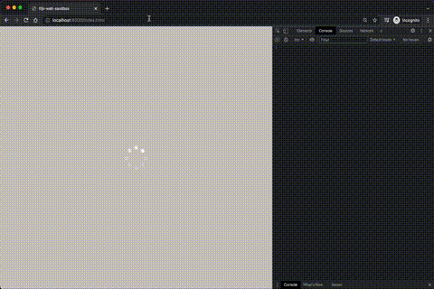
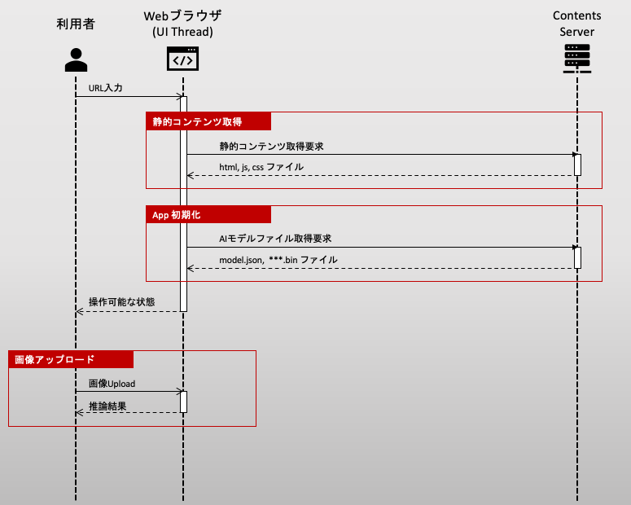
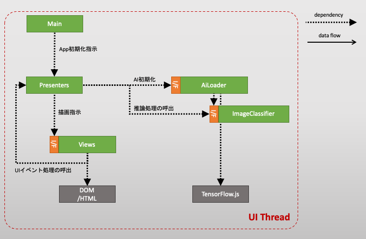

## 記事の目的

ニューラルポケット株式会社 技術戦略部の見上です。

AIモデルを組込んだWebアプリのプロダクト開発の現場において、パフォーマンスについての以下のような課題がしばしば発生して悩まされました。

- AI推論処理によって、UI描画処理を妨げられてしまう
- AIモデルはファイルサイズが大きいため、ネットワーク経由でのダウンロード負荷が高い
- クライアントPCの性能によっては、AI推論処理が極端に遅い

これらの課題を解決するため、Web Worker, Indexed DB などの比較的新しい Web API や、 TensorFlow.js の Web-Assembly バックエンド等の仕様を調査していきました。日本語の記事でまとまったものがなかなか見当たらず、自己完結的な解説記事があるとよかったなあと思ったので、整理も踏まえてまとめて共有しようというのが、この記事の目的になります。

以下のテーマは少なくとも整理したいと思うので、シリーズものになると思います。

1. TensorFlow.js を拡張性を意識して Model-View-Presenterデザインパターンの中に取り込む
2. ブラウザ上のAI推論タスクを Web Worker でUIスレッドと分離する
3. AIモデルを IndexedDB でブラウザにキャッシュする
4. TensorFlow.js + WASM でCPU環境でも高速にAI推論タスクを行う

本記事は、 1. の内容に当たります。

## 前提知識

- フロントエンド
  - TypeScript
  - Dependency Injection の考え方 (inversify.jsをDIライブラリとして使います)
- AIフレームワーク
  - TensorFlow の事前学習モデルを使った経験

上記以外の知識は、適宜補うつもりです。

## シリーズを通して扱うサンプルアプリ

以下のようなアプリをサンプルとして扱いたいと思います。




仕様は文章で書くと、以下のようなものです。

- 入力:
  - ローカルに存在する画像ファイルを一つ選択し、アップロードする。
- 出力:
  - 入力画像ファイルに対して、以下の推論処理を行う。
    - 画像分類タスクの事前学習モデル (MobileNetV1) で推論を行う。
  - 推論結果のラベルとスコアを、画面に表示する。


## シーケンス図

アプリの処理フローを把握するために、シーケンス図を以下に示します。




注意したいのは、Webブラウザでは、通常はスレッド一つで処理が行われるということです。AI初期化や推論処理は高負荷なため、UI描画をしばしば阻害しやすくなってしまいます。

なおJavaScript には Promise 等の擬似的な非同期処理の仕組みがあるのはご存じの方が多いと思います。確かに通信の応答待ちなどWebブラウザが計算タスクを持たない場合には待ち時間中にUI処理はブロックされません。ところがAI初期化や推論など、Webブラウザ側で本当にやるべき計算がある場合には、Promise等の非同期制御だけでは結局UI処理が阻害されてしまうことに注意してください。

つまり、ユーザがWebブラウザを開いてから操作可能な画面が帰ってくるまでの間、ユーザはブラウザの画面が固まっている状態を体験してしまいます。

この問題は、別の記事で説明する Web Worker を用いたWorkerスレッドの分離で解決しますが、本記事はひとまずアプリの骨組みを作るところまで進めましょう。


## ソフトウェア・アーキテクチャ

まずアプリの骨組みとなる、クラス設計を行います。ここでは、いわゆる Model-View-Presenter モデルを採用し、画面表示と描画ロジック、そしてAI処理を完全に分離することを目指します。

依存関係を明示したクラス図は以下のようになります。




それぞれの役割は、

| 要素 | 役割 |
| --- | ------- |
| View | Presenterからの描画指示を受けて、描画する。また、UIイベントが発生したら処理を Presenter に委譲する。 |
| Presenter | 描画ロジックを実行し、View に描画指示を行う。 |
| Model | `AiLoader`: AIの初期化処理を行う。 `ImageClassifier`: 画像データを受け取り、推論を行い、推論結果を返す。 |

と定めます。ポイントは、TensorFlow.js に依存する実装はすべて Model の領域で閉じ込めるようすることです。
これにより、AIの推論処理と、UI処理が完全に分離され、AI部分の改善に対しても改修範囲をModel内部に局所化することができます。


## フレームワーク・ライブラリ

実装に関連するライブラリ選定をしておきます。

まずフロントエンドのプロダクト開発で型付き言語は必須なので Typescript を前提にします。
また、この記事はUIフレームワークに依存したものにしたくないので、React, Vue.js, Angular 等のライフサイクルを司るフレームワークは利用しません。
ただし、先に示したソフトウェア・アーキテクチャを実現する上で、Dependency Injection 機構は必須なので、DIコンテナライブラリとして inversify.js を利用します。

結局 `package.json` は以下のようになりました。
ビルドは何でも良いのですが、 `esbuild` を使います。

```json
{
  "name": "tfjs-web-sandbox",
  "version": "1.0.0",
  "description": "",
  "main": "index.js",
  "scripts": {
    "build": "esbuild --bundle ./src/index.ts --outfile=./www/index.js",
    "start": "yarn build --servedir=./www"
  },
  "author": "",
  "license": "ISC",
  "devDependencies": {
    "@typescript-eslint/eslint-plugin": "^5.8.1",
    "@typescript-eslint/parser": "^5.8.1",
    "esbuild": "^0.14.9",
    "eslint": "^8.6.0",
    "eslint-config-google": "^0.14.0",
    "typescript": "^4.4.4"
  },
  "dependencies": {
    "@tensorflow/tfjs": "^3.12.0",
    "inversify": "^6.0.1",
    "reflect-metadata": "^0.1.13"
  }
}
```


## 学習済のfrozen model(.pb)をWebモデルに変換する

実装に入る前に、今回利用するモデルをTensorFlow.jsで取込可能なWebモデルに変換する必要があります。

この解説では、TensorFlow frozen model形式のpbファイルを、事前に作成済とします。
ここでは、画像を1000クラスに分類する MobileNetV1 事前学習モデルを、[ここ](https://github.com/tensorflow/models/blob/master/research/slim/nets/mobilenet_v1.md)から入手しました。

pbファイルを `tensorflowjs_converter` でWebモデルに変換します。

```
$ pip install tensorflowjs_converter
```

インストールができたら、 pbファイルを指定してWebモデルを生成します。
`./frozen/mobilenet_v1_1.0_224_frozen.pb` このパスのpbファイルを配置してから、

```
$ tensorflowjs_converter \
  --input_format=tf_frozen_model \
  --output_node_names='MobilenetV1/Predictions/Reshape_1' \
  ./frozen/mobilenet_v1_1.0_224_frozen.pb ./web   
```

を実行します。成功すると、`model.json` ファイルと、Webモデルのバイナリファイルが `./web` 配下に配置されます。

`--output_node_names`オプションには、モデルの出力ノード名称を指定する必要がありますので、入力モデルのアーキテクチャを確認して正しく設定します。

生成されたWebモデルファイルは、コンテンツサーバ上に以下のように公開します。

```bash
<DocumentRoot>
└── /models/mobilenet
    ├── group1-shard1of5.bin
    ├── group1-shard2of5.bin
    ├── group1-shard3of5.bin
    ├── group1-shard4of5.bin
    ├── group1-shard5of5.bin
    └── model.json
```


## Model部分の実装

それでは、AI部分の実装を始めていきましょう。

### 画像分類クラス: `ImageClassifier`

まず画像分類クラスから始めます。仕様を決めるインターフェースを作ってから、具体的な実装を作る、というふうにインターフェースと実装を意識して分離します。
別記事で説明する Web Worker の実装の際に、この分離が効きます。

#### インターフェース定義

まずインターフェースを、以下のように決めます。

```typescript
// file path: app/model/image-classifier/IImageClassifier.ts

export type ImageClassifierOutput = { classId: number, score: number };

export interface IImageClassifier {
  load(): Promise<void>
  classify(input: ImageData): Promise<ImageClassifierOutput>
}
```

つまり、`ImageClassifier` は、Webモデルファイルをロードする機能(`load`)と、 入力となる画像データを受け取って推論結果を返す機能(`classify`)を持つこととします。 

`classify` の引数について、なぜ入力画像を `HTMLImageElement` 等のDOM要素ではなく、 `ImageData` 形式にしているのか、気になった方もあるかもしれません。
その理由は、Web WorkerスレッドにAI処理を分離した際に、Web WorkerスレッドからDOMが読めないからなのですが、別記事で詳しく説明します。


#### 実装

さてインターフェースを、以下のように実装します。

```typescript
// file path: app/model/image-classifier/impl/ImageClassifier.ts

import {injectable} from 'inversify';
import * as tf from '@tensorflow/tfjs';
import {IImageClassifier, ImageClassifierOutput} from '../IImageClassifier';


@injectable()
export class ImageClassifier implements IImageClassifier {
  private mobilenet!: tf.GraphModel;

  async load(): Promise<void> {
    // MobileNetV1 モデルのセットアップを行う
    this.mobilenet = await tf.loadGraphModel(
        '/models/mobilenet/web/model.json',
    );

    // warm-up する
    const resultTf = this.mobilenet.predict(tf.zeros([1, 224, 224, 3])) as tf.Tensor;
    resultTf.dataSync();
    resultTf.dispose();
  }

  async classify(input: ImageData): Promise<ImageClassifierOutput> {
    // 入力画像をモデル入力サイズ [1, 224, 224, 3] に変換する
    const inputTf = tf.tidy(() => {
      return tf.browser
          .fromPixels(input)
          .resizeBilinear([224, 224])
          .expandDims(0);
    });

    // 推論を行い、確率ベクトル [1, 1000] を取得する
    const resultTf = this.mobilenet.predict(inputTf) as tf.Tensor;

    // 最大確率をもつラベルIDを取得する
    const argmaxTf = tf.tidy(() => resultTf.squeeze().argMax());

    // スコア値を取得する
    const classId = argmaxTf.dataSync()[0];
    const score = resultTf.dataSync()[classId];

    // 使い終わったtensorを開放する
    inputTf.dispose();
    resultTf.dispose();
    argmaxTf.dispose();

    return {classId, score};
  }
}
```

まず `load` メソッドでは、WebモデルのURLを指定してモデルを初期化し、空のテンソルを渡して推論処理を初回実行し、モデルを完全にロードさせます。
WebモデルのURLは、先程 `tensorflowjs_converter` で生成したWebモデルのjsonのURLを指定します。

推論メソッド `classify` では、以下の点に注意します。

- モデルファイルの入力形式に合わせて、画像データをテンソルに変換する必要があります。 今回利用した MobileNetV1 は入力テンソルの形式が `[1, 224, 224, 3]` に指定されているので、それに合わせて入力の `ImageData` を変換します。
- このモデルファイルの出力テンソル形式は `[1, 1000]` です。argmaxをとり、最も確からしいクラスIDとそのスコアを取り出すようにします。
- 途中で生成したテンソルは明示的に `dispose()` してメモリ開放しなければいけません。

### AI実行環境の初期化: `AiLoader`

個別のモデルファイルを初期化する前に、TensorFlow.js の初期化 `tf.ready()` を実行し、最適なバックエンドを設定する必要があります。
そこで、`ImageClassifier` とは別の初期化用のサービスクラスを作ります。

インターフェース定義と、実装を分離して以下のようにします。

```typescript
// file path: app/model/ai-loader/IAiLoader.ts

export interface IAiLoader {
  load(): Promise<void>;
}
```

```typescript
// file path: app/model/ai-loader/impl/AiLoader.ts

import {inject, injectable} from 'inversify';
import {IAiLoader} from '../IAiLoader';
import * as tf from '@tensorflow/tfjs';
import {IImageClassifier} from '../../image-classifier/IImageClassifier';
import {TYPES} from '../../../../config/dependency/types';

@injectable()
export class AiLoader implements IAiLoader {
  constructor(
    @inject(TYPES.ImageClassifier) private imageClassifier: IImageClassifier,
  ) {}

  async load(): Promise<void> {
    // TensorFlow.js のセットアップを行う
    await tf.ready();
    console.info('tfjs backend=', tf.getBackend());

    // MobileNetV1 モデルのセットアップを行う
    await this.imageClassifier.load();

    // 複数モデルを使う場合は、ここにloadを追記していく...
  }
}
```

`load`メソッドでは、２つのことを行っています。

- `tf.ready()` を明示的に行い、TensorFlow.js のバックエンドを選定し、`tf.getBackend()` で選定されたバックエンドを返します。選定の仕様は、おおよそ以下の通りです。
  - ハードウェアアクセラレータが実行できるWebブラウザ環境の場合は `webgl` バックエンドが選定される
  - 上記以外の場合は `cpu` バックエンドが選定される
- アプリで利用するAIモデルを個別にセットアップします。

TensorFlow.js のバックエンドについては、WebAssembly 導入時に触れますので、別記事で詳しく整理したいと思います。

以上で AI部分の実装は完了しました。

## UIの実装

あとは、Presenter と View を実装するだけですが、このUI関連部分の実装はこのシリーズの解説の目的からはずれてくるので、細かくは説明しません。

参考までに、Presenter の実装は以下のように実装しました。

- アプリ初期化のとき `initialize` メソッドが呼ばれ、AIモデルがロードされる
- ファイルアップロード時に `processFile` メソッドが呼ばれ、 画像の推論処理が行われる

この2点だけ、注目いただければ良いと思います。

```typescript
import {inject, injectable} from 'inversify';
import {TYPES} from '../../../config/dependency/types';
import {IAiLoader} from '../../model/ai-loader/IAiLoader';
import {IImageClassifier} from '../../model/image-classifier/IImageClassifier';
import {IIndexView} from '../../view/index/IIndexView';

@injectable()
export class IndexPresenter {
  constructor(
    @inject(TYPES.AiLoader) private aiLoader: IAiLoader,
    @inject(TYPES.ImageClassifier) private imageClassifier: IImageClassifier,
    @inject(TYPES.IndexView) private indexView: IIndexView,
  ) {
    this.indexView.setPresenter(this);
  }

  async initialize(): Promise<void> {
    this.indexView.showLoading(true);
    await this.aiLoader.load();
    this.indexView.showLoading(false);
  }

  async processFile(imageData: ImageData): Promise<void> {
    this.indexView.showLoading(true);
    const res = await this.imageClassifier.classify(imageData);
    this.indexView.updateResult(`class id: ${res.classId}, score: ${res.score})`);
    this.indexView.showLoading(false);
  }
}
```

## 現時点での問題点

さて、以上をもちまして、初期的なサンプルアプリの実装は完了しました。
ですが、解説の途中で不満を述べたものも含めて、以下の解決すべき課題が残っています。

- 課題1. 画面の初回ロード中や、推論中に、ローディングアニメーションが、カクついてしまう。
- 課題2. 初回ロードで、いつもモデルファイルをダウンロードするので、待機時間が長く、ネットワーク負荷が高い。
- 課題3. ハードウェアアクセラレータ付きの環境では、TensorFlow.jsバックエンドが`webgl`に設定され、高速に処理できる一方で、そうでない環境においてはバックエンドは`cpu`となり、実行速度が許容できないレベルで遅くなる。

これらに対応するため、今回作った初期的なサンプルアプリのAI部分を改善していきます。


## 参考文献

[TensorFlow.js 公式のAPIドキュメント](https://js.tensorflow.org/api/latest/?hl=ja)

[tensorflowjs_converter 公式ドキュメント (github)](https://github.com/tensorflow/tfjs/tree/master/tfjs-converter)

[InversifyJS (DIコンテナ) 公式ドキュメント](https://inversify.io)

[MobileNet系事前学習モデルのアーカイブ](https://github.com/tensorflow/models/blob/master/research/slim/nets/mobilenet_v1.md)