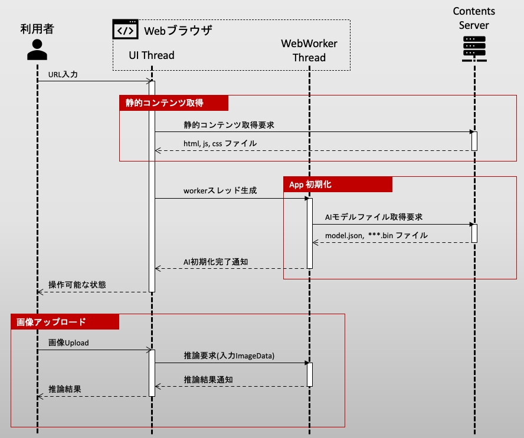
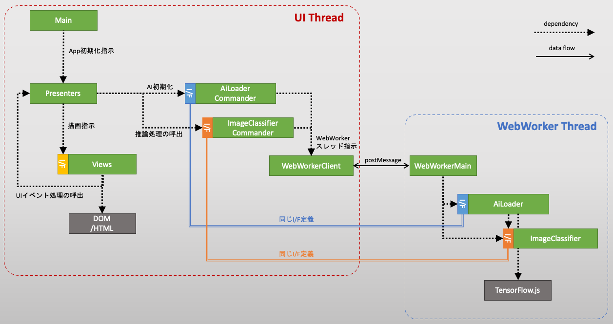

## 記事の目的

ニューラルポケット株式会社 技術戦略部の見上です。

1. TensorFlow.js を拡張性を意識して Model-View-Presenterデザインパターンの中に取り込む
2. ブラウザ上のAI推論タスクを Web Worker でUIスレッドと分離する
3. AIモデルを IndexedDB でブラウザにキャッシュする
4. TensorFlow.js + WASM でCPU環境でも高速にAI推論タスクを行う

本記事は、 2. の内容に当たります。

## 前提知識

前回の記事を読んでいること。

## 課題意識

- 課題1. 画面の初回ロード中や、推論中に、ローディングアニメーションが、カクついてしまう。

## シーケンス図

## ソフトウェア・アーキテクチャ

## 参考文献

[Web Worker API](https://developer.mozilla.org/ja/docs/Web/API/Web_Workers_API/Using_web_workers)