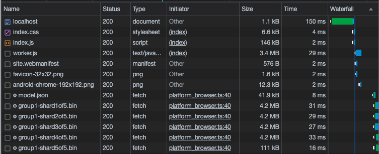
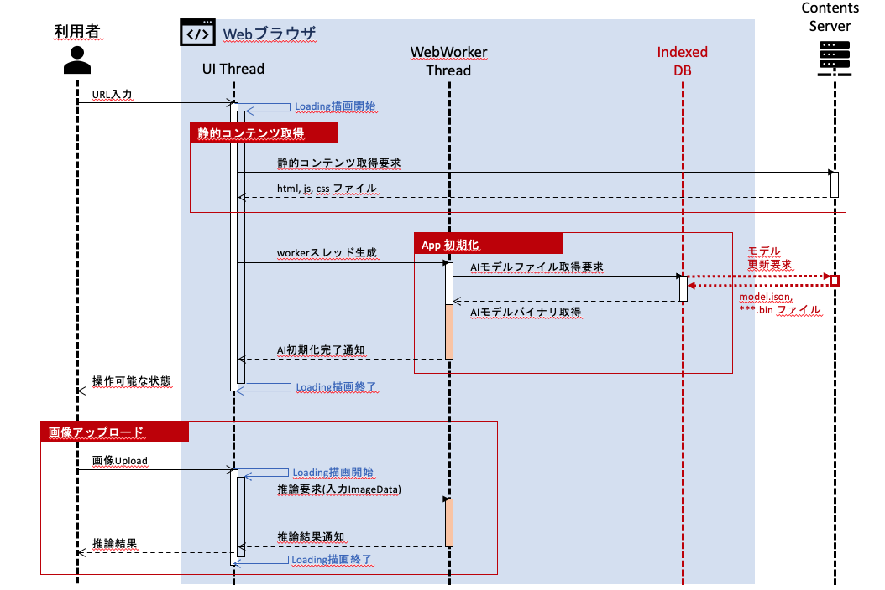
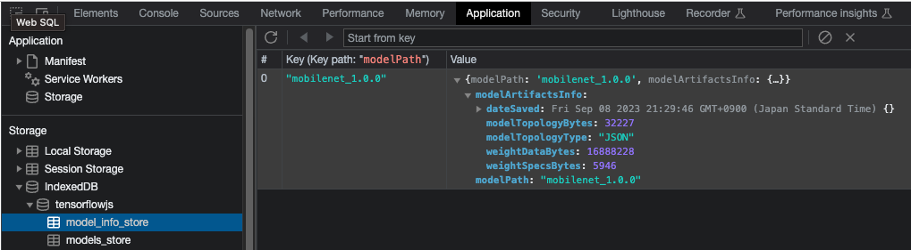
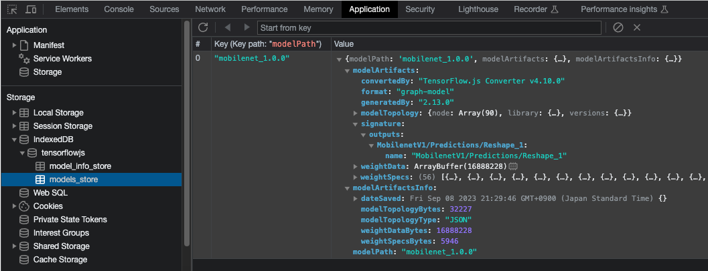

## この記事について

[ニューラルグループ株式会社](https://www.neural-group.com/) 技術戦略部の見上です。
TensorFlow.jsを使ったAIモデルを組込んだWebアプリの性能改善についての実践記事です。なるべく自己完結型に書くようにしています。

<span>0.</span> <a href="https://qiita.com/Cafebabe_TimeLapse/items/4526a0b1f3ab234cfa93">TensorFlow.js を拡張性を意識して Model-View-Presenterデザインパターンの中に取り込む</a>
1. [ブラウザ上のAI推論タスクを Web Worker でUIスレッドと分離する](https://qiita.com/Cafebabe_TimeLapse/items/a1252a753e19b78d734c)
2. AIモデルを IndexedDB でブラウザにキャッシュする (本記事)
3. TensorFlow.js + WASM でCPU環境でも高速にAI推論タスクを行う

サンプルアプリのソースコードは [github](https://github.com/CafebabeTimeLapse/tfjs-web-sandbox) にあげていますのでご参照ください。

## 解決したい課題

[初回の記事](https://qiita.com/Cafebabe_TimeLapse/items/4526a0b1f3ab234cfa93) で、TensorFlow.js で学習済AIモデルを配布してWebアプリを作る場合に気にすべき性能課題を３つ挙げましたが、この記事ではその中の

> 課題2. 初回ロードで、いつもモデルファイルをダウンロードするので、待機時間が長く、ネットワーク負荷が高い。

を改善したいと思います。まず、現状のサンプルアプリケーションの初回アクセス時のネットワーク負荷をChrome開発者機能のNetworkタブで見てみると以下のようになりました。



`model.json` と `group1-***.bin` が我々の作ったWebモデルのバイナリで、数えてみると全20MBの通信のうち、17MBがモデルの転送に使われています。初回であれば仕方ないですが、画面の更新のたびにモデルのダウンロードに帯域を奪われるのは無駄ですので、
一度取得したモデルのバイナリファイルは、次回以降は取得しなくてよいようにブラウザにキャッシュしたいわけです。

## IndexedDB の採用理由

ブラウザのキャッシュ機構としては、今回扱う IndexedDB 以外にも、 session storage や local storage がありますが、これをAIモデルのキャッシュに利用しづらい明確な理由があります。
まず上記の web storage は主要なブラウザでの上限は約5MBと言われており、AIモデルのバイナリを保持するには十分ではありません。
より致命的な点として、web storage は web worker スレッドでは利用できません。
そのため、UI描画とAI処理を別スレッドに分ける戦略（[前回記事](https://qiita.com/Cafebabe_TimeLapse/items/a1252a753e19b78d734c)）を取る場合 IndexedDB ほぼ一択になります。

以上を踏まえて、 IndexedDB を使って AIモデルの初回ロード時のシーケンスを以下のように変更することを行います。



ポイントは、

- App初期化の時、まずは IndexedDB からモデルのバイナリを取得するように試みる
- IndexedDBに該当のバイナリファイルが存在しない場合に、初めてWebサーバからモデルを取得する

ように実装するということです。


## TensorFlow.js API による IndexedDB 操作

[IndexedDB](https://developer.mozilla.org/ja/docs/Web/API/IndexedDB_API) は、 ブラウザのキャッシュ機構の中でも、非同期的なアクセスができ、Web Workerスレッドからも参照可能な key-value ストアです。
容量制限も実質無く、主要な全てのWebブラウザでサポートされています。
TensorFlow.js は IndexedDB を内部でサポートしており、IndexedDB の API仕様には深入りすることなく、IndexedDB のキャッシュ機構を実現できます。

### IndexedDB へのキャッシュ書き込み

IndexedDB に web モデルを保存するには、

```
// mobilenet web モデルを Webサーバ localhost:8000 に配置した場合
const modelUrl = 'http://localhost:8000/models/mobilenet_1.0.0/model.json';
const model = await tf.loadGraphModel(modelUrl);
```

のようにしてロードした `model` に対して

```
const modelName = 'mobilenet_1.0.0'
const saveResults = await model.save(`indexeddb://${modelName}`);
```

を実行します。これを実行した後で、 Chrome の Applicatons タブの IndexedDB の中身を見ると、
- `tensorflowjs` データベース
  - `model_info` オブジェクトストア: モデルのメタ情報が格納される
  - `models_store` オブジェクトストア: モデルの重みなどのパラメータが格納される

が生成されていることがわかります。







TensorFlow.js の仕様で、`indexeddb://...` を指定した `model.save` が実行されると、 上記の `tensorflowjs` データベースと 2つのオブジェクトストアが勝手に作成されます。

上の例では、オブジェクトストアには キーが `mobilenet_1.0.0` のオブジェクトが１つ保存されているのが確認できます。
TensorFlow.js では `model.save(indexeddb://${modelName})` を実行した時の `modelName` がオブジェクトストアのキーになります。


### IndexedDB からモデル読み込み

IndexedDB からモデルをロードするには、単に

```
const loadedModel = await tf.loadGraphModel(`indexeddb://${modelName}`);
```

とするだけです。ただし、このとき IndexedDBの `tensorflowjs` データベースに、`modelName` と同じキーのモデルファイルが保存されている必要があります。そうでなければ例外がスローされます。


### IndexedDB に保存済みのモデルの一覧

```
const list = await tf.io.listModels();
```

で、IndexedDBに保存されているモデルを取得することができます。この `list` はモデルのパスをキーにもつ連想配列で、単にモデルのリストアップをするだけなら
```
console.log(Object.keys(list));
// [ 'indexeddb://mobilenet_1.0.0' ]
```
のようにキーだけ参照すれば十分です。

### IndexedDB からのキャッシュの削除

最後に削除ですが、モデルのパスを指定して以下のようにします。

```
await tf.io.removeModel('indexeddb://mobilenet_1.0.0')
```


## 実装

以上のAPIで実装したいことは簡単にできてしまいますので、この節で実装の説明をします。
ただし、実用上、注意しなければいけない問題が２つあります。

- モデル更新の問題：新しいモデルファイルを更新配布したい場合、Webサーバを更新しても IndexedDB にキャッシュされてしまう限り、モデルが更新されないことが起こりえます。そこで、サーバとクライアントでバージョン管理を行う仕組みが必要になります
- 不要なモデルの削除：バージョン管理できたとして、古いバージョンのモデルファイルがローカルに残り続けるとユーザのストレージをどんどん圧迫してしまうため、不要なモデルは削除する必要があります

このことに注意して、前回の記事で Web Worker 側で実装された AI ロードの実装クラスを修正します。

### モデル初期化クラス

`AiLoader` 実装クラスを以下のように修正します。

```
// app/model/ai-loader/impl/AiLoader.ts

import {inject, injectable} from 'inversify';
import {IAiLoader} from '../IAiLoader';
import * as tf from '@tensorflow/tfjs';
import {IImageClassifier} from '../../image-classifier/IImageClassifier';
import {TYPES} from '../../../../config/dependency/types';
import {REQUIRED_MODELS} from '../../../../config/required-models';


const now = () => new Date().getTime();

@injectable()
export class AiLoader implements IAiLoader {
  constructor(
    @inject(TYPES.ImageClassifier) private imageClassifier: IImageClassifier,
  ) {}

  async load(): Promise<void> {
    // TensorFlow.js のセットアップを行う
    const t00 = now();
    await tf.ready();
    console.info('tfjs backend=', tf.getBackend());
    const t01 = now();
    console.info('TensorFlow.js initialized. Elapsed:', t01 - t00, 'msec');

    // 不必要なモデルを IndexedDB から削除する
    const localModels = await tf.io.listModels();
    const requiredIdbModelUrl = REQUIRED_MODELS.map(modelName => `indexeddb://${modelName}`);
    for (const modelUrl of Object.keys(localModels)) {
      if (requiredIdbModelUrl.includes(modelUrl)) continue;
      await tf.io.removeModel(modelUrl);
      console.info('model in indexedDB removed:', modelUrl);
    }

    // MobileNetV1 モデルのセットアップを行う
    await this.imageClassifier.load();
  }
}

```

アプリのロード時に `load` メソッドが実行されますが、その時に `REQUIRED_MODELS` リストに無いモデルは全て IndexedDB から削除します。
これによって、サーバ側で新しいモデルが配布されて `REQUIRED_MODELS` が更新されると、ローカルにキャッシュされた古いモデルは削除させることができます。

### 推論クラス

推論実装クラス `ImageClassifier` も `load` 処理を以下のように修正します

```
// app/model/image-classifier/impl/ImageClassifier.ts

// (中略)

@injectable()
export class ImageClassifier implements IImageClassifier {
  private mobilenet!: tf.GraphModel;
  modelName = 'mobilenet_1.0.0';

  async load(): Promise<void> {
    const t00 = now();

    // MobileNetV1 モデルのセットアップを行う
    const localModels = await tf.io.listModels();
    const idbModelUrl = `indexeddb://${this.modelName}`;
    const webModelUrl = `/models/${this.modelName}/web/model.json`;

    // indexedDBにモデルが保存されていれば、indexedDBから読み込む。
    // そうでなければ webモデルを読み込み、indexedDBに保存する。
    if (idbModelUrl in localModels) {
      this.mobilenet = await tf.loadGraphModel(idbModelUrl);
      console.info('model loaded from indexedDB:', idbModelUrl)
    } else {
      this.mobilenet = await tf.loadGraphModel(webModelUrl);
      console.info('web model loaded:', webModelUrl)

      await this.mobilenet.save(idbModelUrl);
      console.info('model saved in indexedDB:', idbModelUrl)
    }

    // warm-up する
    const resultTf = this.mobilenet.predict(tf.zeros([1, 224, 224, 3])) as tf.Tensor;
    resultTf.dataSync();
    resultTf.dispose();

    const t01 = now();

    console.info('MobileNetV1 initialized. Elapsed:', t01 - t00, 'msec');
  }

  // (中略)
}

```

コードコメントに書いてある通りですが、`tf.io.listModels` で取得した IndexedDB のキーの中に自分のバイナリがあれば IndexedDB から読み込み、無ければ Webサーバから読み込んで IndexedDB に保存します。

実装は以上で終わりです。TensorFlow.js で用意されているAPIだけで簡単に実装できました。


## この記事のまとめ

この記事では、 TensorFlow.js で Webモデルのロード負荷を抑えるための IndexedDB の利用方法の考え方と実装例についてまとめました。
次回は、Web Assembly による CPU環境での最適化の記事を書きます。

## 参考文献

- [IndexedDB](https://developer.mozilla.org/en-US/docs/Web/API/IndexedDB_API)
- [IndexedDB in TensorFlow.js](https://js.tensorflow.org/api/latest/#Models-Management)
